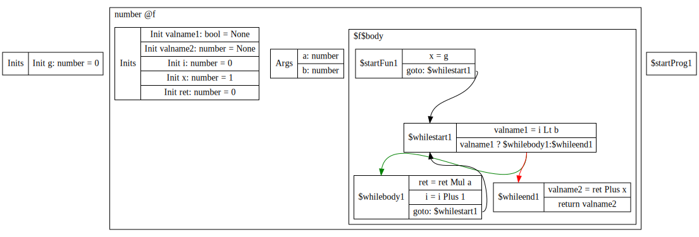

# Design of Optimization on Compiler B

## A. Test cases / Scenarios
> Analyses that extract useful guidance for potential transformations without altering the IR

### 1. Liveness Analysis
**Original**
```python
def f(x: int):
  if True:
    return x + 1
  else:
    x = x * 2
    return x + 1
```
**Tagged**
```python
def f(x: int):
  if True:
    return x + 1
  # Dead
  else:
    x = x * 2
    return x + 1
  # Dead
```

### 2. IR-CFG Visualization
**Pseudo IR-CFG**
```python
while True:
  A() # L-A
  if-goto L-C
  B() # L-B
  C() # L-C
```
**Dot-plot**



> Modifications on the ast / IR to improve efficiency 
### 3. Eliminate Unreachable Instructions After Return
**Before Optimization**
```python
def f(i:int):
    return i
    print(i+1)
```
**After Optimization**
```python
def f(i:int):
    return i
```

### 4. Eliminate Dead Branch
**Before Optimization**
```python
def f(i:int):
    if True:
      return i + 1
    else:
      return i * 2
```
**After Optimization**
```python
def f(i:int):
    return i + 1
```

### 5. Eliminate instructions that only affects dead variables

**Before Optimization**
```python
a: int = 1
b: int = 2
a = a + 1
b = b + a
return a
```

**After Optimization**
```python
a: int = 1
b: int = 2
a = a + 1
return a
```

### 6. Constant Propagation

**Before Optimization**
```python
x:int = 100
y:int = 10
y = x + 1
x = x + x
```
**After Optimization**

```python
y:int = 10
y = 100 + 1
x = 100 + 100
```

### 7. Constant Folding For Int

**Before Optimization**
```python
x:int = 5
x = x * 0
```
**After Optimization**
```python
x:int = 5
x = 0
```

### 8. Constant Folding For Bool

**Before Optimization**
```python
x: bool = True
x = False or (False and True)
```
**After Optimization**
```python
x: bool = True
x = False
```

### 9. Combine Redundant Code

**Before Optimization**
```python
x:int = 1
y:int = 2
a:int = 0
a = 2 * (x+y) + 3 * (y + x) + 5 * (x+y)
```

**After Optimization**
```python
x:int = 1
y:int = 2
a:int = 0
e:int = 0
e = x + y
a = 2 * e + 3 * e + 5 * e
```

### 10. Eliminate Redundant Code
**Before Optimization**
```python
x:int = 1
x = x
```

**After Optimization**
```python
x:int = 1
```

## B. Modification on AST and IR
We aim to leave `ast` and `IR` as intact as possible. We are expecting to compute useful informations out of current framework instead of attaching the information to their implementations.

## C. New Changes
Two new files `ast-opt` and `ir-opt` may be added to implement optimizations on `ast` and `ir` respectively.
Among these two options, a majority of optimizations will be implemented in the first one since we can take advantage of the existing informations and control-flow awareness. Once we move to the second stage where structured information is obfuscated, we can apply relatively simple and general schemes that optimize the CFG topologically. We may not change the process of *ast -> ir* or *ir -> wasm text* as this may complicate the implementation of optimizations.

## D. Value Rep and Memory Layout
Dynamic optimizations that happen at runtime or may rely on runtime informations are beyond our scope, so we may not introduce new modifications to the runtime environment. Overall, we aim to optimize the program without imposing restrictions or new assumptions on other groups.

# Compiler B - Optimization - Implementation Update In Week 9

## A. Implemented Passes And Scenarios

### 1. Liveness Analysis
The line-oriented liveness analysis is conducted backward. We didn't employ this information to do any optimizations yet. The algorithm follows the detailed description in [link](https://www.cs.cmu.edu/~rjsimmon/15411-f15/lec/04-liveness.pdf)

**Python**
```python
def f(x: int, i: int) -> int:
  g: int = 1
  while i > 0:
    g = g * x
    if i < 5:
      i = i - 1
    else:
      i = i // 2
  return g
```

**Pseudo-IR**
```python
(init-untouched) 
g = 1
------------------------------------------
whilestart1
-0 v1 = i > 0
-1 if v1 whilebody1-0 else whileend1-0
------------------------------------------
whilebody1
-0 g = g * x
-1 v2 = i < 5
-2 if v2 then1-0 else else1-0
------------------------------------------
then1
-0 i = i - 1
-1 goto end1-0
------------------------------------------
else1
-0 i = i // 2
-1 goto end1-0
------------------------------------------
end1
-0 goto whilestart1-0
------------------------------------------
whileend1
-0 return
```

**Liveness perline**
```python
whilestart1-0 {i, g, x}
whilestart1-1 {i, g, x, v1}
whilebody1-0  {i, g, x}
whilebody1-1  {i, g, x}
whilebody1-2  {i, g, x, v2}
then1-0       {i, g, x}
then1-1       {i, g, x}
else1-0       {i, g, x}
else1-1       {i, g, x}
end1-0        {i, g, x}
end1-0        {i, g, x}
whileend1-0   {g}

```

### 2. Neededness Analysis
Liveness Analysis is not sufficient to indicate the dead code. For example, we may not eliminate an instruction whose varaibles are all dead since it may generate side-effects.
> Raising runtime error when dividing by `0`, but the result is never referred.

Also, a line full of live variables are not deemed to be useful.
> Consider `i = i + 1` but `i` is never used in the future. 

Thus we implemented *Neededness Analysis* as described in [link](https://www.cs.cmu.edu/~rjsimmon/15411-f15/lec/07-dataflow.pdf) to guide the dead code elimination. The algorithm resembles `Liveness Analysis` except with two more rules.

**Python**
```python
a: [int] = None
b: int = 100
a = [1, b, (-50)]
print(a[1])
```

**Pseudo-IR**
```python
(init-untouched) 
b = 100
a = None
----------------------------------
Body0
-0  L1 = alloc(4)
-1  v1 = Neg(50)
-2  L1%0 = 3
-3  L1%1 = 1
-4  L1%2 = b
-5  L1%3 = v1
-6  a = L1
-7  length = load a%0
-8  call bound_check(length, 1)
-9  ofst = 1 + 1
-10 v2 = load a%ofst
-11 call print(v2)
```

**Neededness perline**
```python
$body10   { b },
$body11   { b, L1 },
$body12   { b, v1, L1 },
$body13   { b, v1, L1 },
$body14   { b, v1, L1 },
$body15   { v1, L1 },
$body16   { L1 },
$body17   { a },
$body18   { length, a },
$body19   { a },
$body110  { a, ofst },
$body111  { v2 }
```

### 3. Dead-Code-Elimination
We use *Neededness Analysis* to detect dead code. An instruction/statement is considered to be dead if it fulfills the following requirements:

1. The **left hand side** is not used in any successors.
2. The **right hand side** is *effect-free*.

> Currently we dont have a precise definition for an *effect-free* operation. Empirically, we define a set of *non-effect-free* expressions as : {IntDiv, Mod, Load, Store(though it is a statement), call, alloc}.

In terms of the definition of a successor, we say `l'` is a successor of `l` if it is the following node in the CFG. We can express it in the logical form as:

- `l`: jmp `l'` => succ(`l`,`l'`) 
- `l`: if `cond` then `lt` else `lf` => succ(`l`, `lt`), succ(`l`, `lf`)
- otherwise: succ(l, l + 1)

In the implementation, we never eliminate statements other than dead `assign`, `expr` and any `pass`.

**Python**
```python
while x > 0:
  p = p * x
  z = z + 1
  x = x - 1
print(p)
```

**Pseudo-IR**
```python
---------------------------------
whilestart1
-0 v1 = x > 0
-1 if v1 then whilebody1-0 else whileend1-0
---------------------------------
whilebody1
-0 p = p * x
-1 z = z + 1
-2 x = x - 1
-3 goto whilestart1-0
---------------------------------
whileend1
-0 call print(p)
```

**Neededness Analysis**
```python
whilestart10  { p, x }
whilestart11  { x, p, v1 }
whilebody10   { x, p }
whilebody11   { p, x } (z not needed)
whilebody12   { p, x }
whilebody13   { p, x }
whileend10    { p }
```

**Opted-IR**
```python
---------------------------------
whilestart1
-0 v1 = x > 0
-1 if v1 then whilebody1-0 else whileend1-0
---------------------------------
whilebody1
-0 p = p * x
-1 x = x - 1
-2 goto whilestart1-0
---------------------------------
whileend1
-0 call print(p)
```

### 4. Reaching Analysis

We implemented reaching analysis to get reaching definitions of each variable in each line. We traversed every line in every blocks to propagate the definitions that begin at global or local `inits` , or the assignment statement in `BasicBlock`s. After running the reaching analysis algorithm, an array of maps is generated where each map contains current line's variables' reaching definitions. 
An example of reaching analysis is as follows:

**Python**
```python
i: int = 3
a: int = 2
while i > 0:
  print(i)
  print(a)
  i = i-1
```

**Pseudo-IR**
```python
---------------------------------
$varInits:
valname1 = none
i = 3
a = 2
---------------------------------
$startProg1
jmp $whilestart1
---------------------------------
$whilestart1
valname1 = (i > 0)
ifjmp valname1 then $whilebody1 else $whileend1
---------------------------------
whilebody1
print(i)
print(a)
i = i+1
jmp $whilestart1
---------------------------------
$whileend1
---------------------------------
```

**Reaching Definition**
```python
$startProg1_0
valname1: ()                i: ($varInit_0)                 a: ($varInit_1)  
$whilestart1_0
valname1: ($whilestart1_0)  i: ($varInit_0, $whilebody1_2)  a: ($varInit_1)  
$whilestart1_1
valname1: ($whilestart1_0)  i: ($varInit_0, $whilebody1_2)  a: ($varInit_1)  
$whilebody1_0
valname1: ($whilestart1_0)  i: ($varInit_0, $whilebody1_2)  a: ($varInit_1)  
$whilebody1_1
valname1: ($whilestart1_0)  i: ($varInit_0, $whilebody1_2)  a: ($varInit_1)  
$whilebody1_2
valname1: ($whilestart1_0)  i: ($varInit_0, $whilebody1_2)  a: ($varInit_1)  
$whilebody1_3
valname1: ($whilestart1_0)  i: ($whilebody1_2).             a: ($varInit_1)  
```

### 5. Constant Propagation
The constant propagation is implemented on the basis of reaching definition. We would propagate the constant value to an id only if it's reaching definition is unique. We performed constant propagation in Program, FunDef and Classes' methods, and we would not propagate the global definitions (classes' fields or global variables) since they could be re-assigned in other function or methods' bodies. 

## B. Modification on AST and IR
we have no modifications on ast.ts and ir.ts

## C. Test
To conduct automatic testing, we implement two functions in the `./tests/asserts.test.ts`, which are `assertOptimize` and `assertPass` functions. For the `assertOptimize` function, we run the codes before and after optimization respectively. **When the runtime results of two generated WASM codes matched, and the length of the optimized WASM code is shorter than the original WASM codes, we consider a test case is passed.** Similarly, for `assertPass` function, the only difference with `assertOptimize` is that the test case is considered pass when the length of optimized WASM code is shorter or equal to the original WASM code. The purpose for this function is for the test cases of `pass` statements since such statements do not generate any WASM codes. For example, a test case like,

```python
def f():
    pass

pass
f()
pass
```

will generate the same exact results before and after optimization. Despite that the optimization for `pass` statement does not make a difference in this scenario, such step is still necessary because some of the optimization steps will generate new `pass` statements to the program (for example, for a `while` loop with `False` literal as its condition, we will replace the `while` loop with a `pass` statement to avoid an empty if/function/while/program body). 

We added 47 test cases in `optimize.test.ts` to test the optimization effect, which covers 
* constant folding for different binary operators and unary operators on number and boolean literals;
* constant folding on builtin functions; 
* dead code elimination after return
* dead code elimiation for if branches
* dead code elimination for while loops
* dead code elimination for pass statements
* dead code elimination for nested while and if structures
* Optimization for class methods
* Optimization for field assignments
* Constant propagation for programs with different kinds of branches 
* A few programs that combine the optimizations above

We also added 39 test cases in `optimize-sanity.test.ts` to make sure our optimization hasn't introduced new bugs into other group's implementation, where we only checks the consistency of programs' running result before and after optimizing. Those test cases cover:
* Destructuring
* Comprehension
* Builtin
* For Loop
* Generic
* List
* Set

## D. Value Representation and Memory Layout
Dynamic optimizations that happen at runtime or may rely on runtime informations are beyond our scope, so we have not introduce new modifications to the runtime environment.
